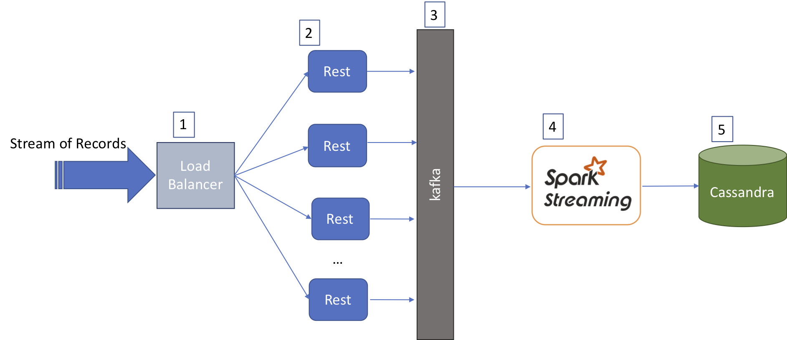
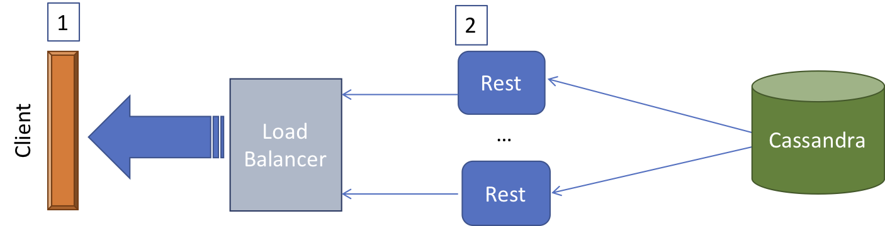

# Coding Solution

Moving Average library consists of two interfaces and two classes as bellow:
* **Interfaces:**
    * [MovingAverage](src/main/java/com/hamidgh/demo/util/MovingAverage.java)
    * [Element](src/main/java/com/hamidgh/demo/util/Element.java)
* **Classes:**
    * [IntegerMovingAverageImpl](src/main/java/com/hamidgh/demo/util/IntegerMovingAverageImpl.java)
    * [GenericMovingAverageImpl](src/main/java/com/hamidgh/demo/util/GenericMovingAverageImpl.java)

*MovingAverage* is the main interface and two classes *GenericMovingAverageImpl* and *IntegerMovingAverageImpl* implement it. *GenericMovingAverageImpl* is the generic implementation and is implemented against *Element* interface: it stores objects implementing *Element* interface. *IntegerMovingAverageImpl* is the implementation of the *MovingAverage* for Integers.

## MovingAverage
This interface declares four methods:
* **add:** Adds an element to the structure.
* **getElement:** Returns the element at the specified index.
* **getSize:** Returns the number of element inside the structure.
* **getMovingAverage:** Returns the moving average of the last N numbers added to this data structure by the *add* method.

The two implementations of the the above interface are almost the same. However, *GenericMovingAverageImpl* abstracts out the elements to *Element* interface. It also maintains the moving average list and we can get not only the latest average but also up-to N previously calculated averages.

## IntegerMovingAverageImpl
The implementation maintains a list holding the integer values added to the structure. The moving average is calculated whenever a new element added to the list. This will make the average retrieval efficient as both *add* and *getMovingAverage* will have the computation complexity of O(1).

## GenericMovingAverageImpl
The implementation maintains two lists: one for holding the elements added to the list, and one for holding the moving average list. This implementation accept elements implementing the *Element* interface. The *getValue* method of *Element* is used to retrieve the value used in average calculation. Aside from these differences, the implementation is the same as *IntegerMovingAverageImpl*.

## Tests
Tests are added to verify the correctness of both *IntegerMovingAverageImpl* and *GenericMovingAverageImpl* implementations.

## 

## Design Solution

The proposed architecture are presented and explained below.

The above system can be implemented in cloud (for example, leveraging AWS or Azure services).

1. **Load Balancer:** This is a loadbalancer that distributes the write request among multiple Rest APIs (for example, AWS load balancer can be used here).
2. **Rest APIs:** These are [containerized](https://www.docker.com/resources/what-container) lightweight Rest APIs (all different instances of the same service) that accept the data feeds (via POST) in JSON format and put them on Kafka. [Kubernetes](https://kubernetes.io/), [Mesos/Marathon](https://mesosphere.github.io/marathon/), or [aws ECS](https://aws.amazon.com/ecs/) services can be used to automatically manage these containerized services.
3. **Kafka**: This is the message broker that acts as medium between the Rest APIs and core processing system implementd by Spark. Kafka temporarily keeps the data to be further processed before storing it into database. 
4. **Spark Streaming**: A cluster of spark worker nodes used to process the data and store them in Cassandra.
5. **Cassandra**: NoSQL Cassandra db used to store the data in a cluster.

In the Cassandra database, we will partition the data based on each user account, and index them based on their corresponding timestamp and data type. This will insure we equally distribute data over the cluster and access it quickly based on time range and datatype.

The clients will request the processed data using another set of containerized Rest APIs as below.

1. **Client:**  sends GET requests to retrieve data based on time range and  data type. The payload is received in JSON format and further processed in client to convert it to graphs and displayed to the user.
2. **Rest APIs:**  These are light-weight Rest APIs that accept requests from clients. They simply retrieve data from Cassandra based on time range and type of data. Similar to previous Rest Services they are containerized and managed by one of the chosen container management systems referred above. In this proposed architecture,  we consider these APIs to be separate from the the above write Rest APIs to allow further flexibility.

We assume all data stored in Cassandra are processed completely at write time and ready to be used directly by the clients. That is, no processing in necessary at the time of read. The above Rest APIs simply deliver the data to the clients based on (clientId, datatype, and timerange).

## How the above architecture aligned with the specified requirements:
* Handle large write volume: Billions of write events per day.

_All the elements in the above architeture can Scale up in Cloud and can handle large write volume._

* Handle large read/query volume: Millions of merchants wish to gain insight into their business. Read/Query patterns are time-series related metrics.

_We define (clientID, dataType, timestamp) as a key in Cassandra. This allows us to respond quickly to read queries based on these parameters._

* Provide metrics to customers with at most one hour delay.

_Spark streaming that is used for processing and storing data on write can scale up to accommodate the required response time._
 
* Run with minimum downtime.

_Using container management systems like Kuberneties or ECS allows us to be resilient: if a container goes down, they will take care of it by starting a new  one based on the system configuration. Using proper replication factor in Cassandra will also ensure we won't miss data in case we lose some nodes. This is the case for the Kafka messaging system as well. Besides we can put in place some monitoring systems like Datadog to monitor system metrics and tweak the infrastructure resources._  

* Have the ability to reprocess historical data in case of bugs in the processing logic.

_We can configure to keep raw data in Kafka for a an hours, or days; we can also parallelly dump the raw data in an archive (S3 bucket for example) for future reference._

